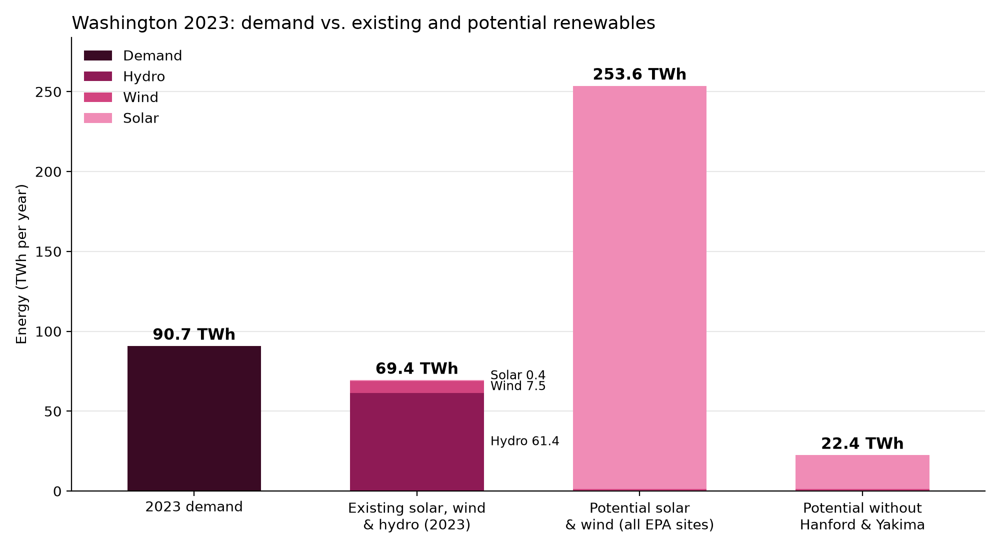
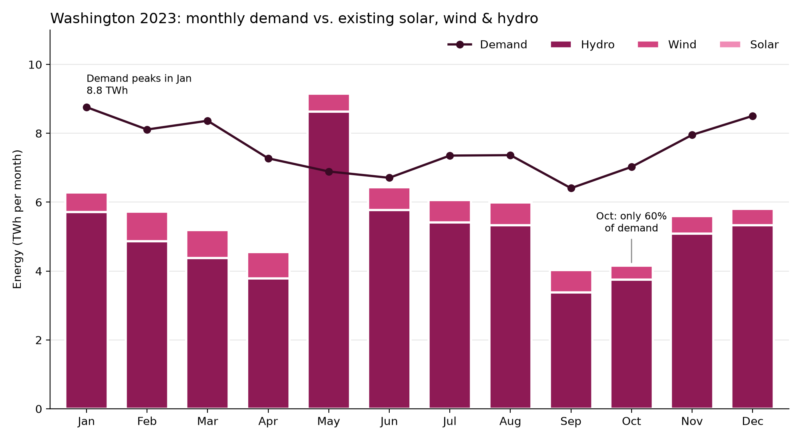

# WAEnergyPotential

**Does Washington have enough solar and wind potential to meet its electricity demand?**

A Python analysis comparing Washington's 2023 electricity demand against its existing solar, wind, and hydro generation and the solar and wind potential of EPA-screened sites.

## Short answer

Not from these EPA sites alone, but Washington is already most of the way there. Existing renewables covered 76% of 2023 demand, mostly from hydro.

*About this repo:* This is a rework of a previous project. The original was built in a class lab notebook, so this repo starts from a fresh rewrite rather than carrying over that history. The first commit contains the full reworked analysis.



## Key findings

- **Existing renewables cover about three quarters of demand.** <br>
Hydro, wind, and solar made 69.4 TWh in 2023, or 76% of the 90.7 TWh the state used. Hydro is 61.4 TWh of that.
- **The EPA sites only look big because of two sites.**<br>
 All 392 sites add up to 253.6 TWh a year (2.8x demand), but Hanford and the Yakima Training Center are 92% of the solar capacity, and neither is likely to be covered in panels. Without them, the potential is 22.4 TWh, or 25% of demand.
- **The gap changes a lot by month.**<br>
 Existing renewables covered 133% of demand in May, but only 60% in October. Winter has the highest demand and the least sun.



See the [Limitations](wa_energy_potential.ipynb) section at the end of the notebook for what this analysis doesn't cover.

## Data sources

| What | Source |
|---|---|
| Hourly electricity demand by county | [OpenEI: Historic county-level hourly load, 2016–2023](https://data.openei.org/submissions/8562) |
| Existing generation by fuel type | [EIA API: electric-power-operational-data](https://www.eia.gov/opendata/browser/electricity/electric-power-operational-data) |
| Potential solar and wind sites | [EPA RE-Powering America's Land](https://www.epa.gov/re-powering) ([mapper](https://geopub.epa.gov/repoweringApp/)) |
| Capacity factors | [EIA Electric Power Monthly, Table 6.07.B](https://www.eia.gov/electricity/monthly/epm_table_grapher.php?t=epmt_6_07_b) |

## How to run it

```bash
git clone https://github.com/annie-boyd/WAEnergyPotential.git
cd WAEnergyPotential
python3 -m venv .venv
source .venv/bin/activate
pip install -r requirements.txt
```

Then open `wa_energy_potential.ipynb` in VS Code (select the `.venv` kernel) or Jupyter, and run all cells.

The downloaded data is saved in `data/`, so the notebook runs without an API key. If you delete those files, the notebook downloads them again, and you'll need a free [EIA API key](https://www.eia.gov/opendata/register.php): copy `.env.example` to `.env` and add your key.

## Project structure

```
wa_energy_potential.ipynb   the analysis
data/                       saved demand, generation, and EPA site data
images/                     charts from the notebook
requirements.txt            Python packages
.env.example                template for the EIA API key
```
